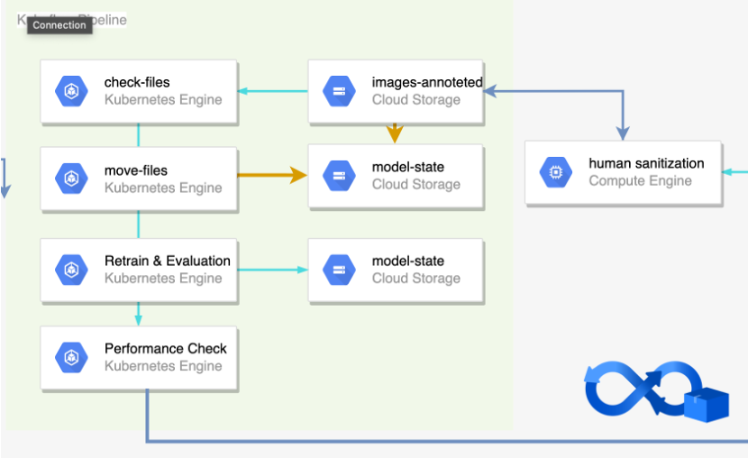
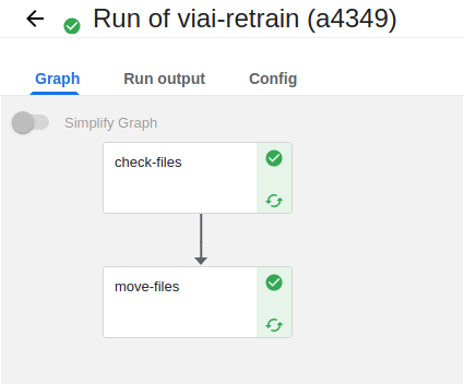

# Kubeflow Pipeline




- [x] Kubeflow Setting on Ubuntu 20.04
- [x] 버킷에 inffered 된 이미지가 100장이 넘는지 확인
- [ ] train 및 evaluation
    - [x] local run
    - [ ] on gcp run

## Dependencies
- kfp (1.8.9)

## How to Run the Code
**Create Pipeline**
```bash
python pipeline.py
```

## Port-Forward and Run Dashboard

```
kubectl port-forward svc/istio-ingressgateway -n istio-system 8080:80
```

- `http://localhost:8080`
- default email address: `user@example.com`
- default password: `12341234`

## References

### Kubeflow

- [Kubeflow Manifest](https://github.com/kubeflow/manifests/tree/v1.4.0)
- [Kubeflow 1.4 설치 with Minikube](https://suwani.tistory.com/18)
- [AI Platform에서 구현하는 Kubeflow Pipelines 기반 ML 학습 및 배포 예제](https://medium.com/google-cloud-apac/gcp-ai-platform-%EC%97%90%EC%84%9C-%EA%B5%AC%ED%98%84%ED%95%98%EB%8A%94-kubeflow-pipelines-%EA%B8%B0%EB%B0%98-ml-%ED%95%99%EC%8A%B5-%EB%B0%8F-%EB%B0%B0%ED%8F%AC-%EC%98%88%EC%A0%9C-part-2-3-22b597f8d127)
- [Serving TorchServe in kubeflow pipelines](https://byeongjokim.github.io/posts/MLOps-Toy-Project-5/)
- [Kubeflow Pipelines – 파이프라인에서 외부 저장소를 이용하기](https://kangwoo.kr/2020/04/04/kubeflow-pipelines-%ED%8C%8C%EC%9D%B4%ED%94%84%EB%9D%BC%EC%9D%B8%EC%97%90%EC%84%9C-%EC%99%B8%EB%B6%80-%EC%A0%80%EC%9E%A5%EC%86%8C%EB%A5%BC-%EC%9D%B4%EC%9A%A9%ED%95%98%EA%B8%B0/)
- [kubeflow pipeline 사용해보기 - kubeflow pipeline example with iris data](https://lsjsj92.tistory.com/581)
- [Python kfp.dsl.ContainerOp() Examples](https://www.programcreek.com/python/example/117617/kfp.dsl.ContainerOp)
- [Kubeflow - Pipelines 소개 - 2](https://byeongjo-kim.tistory.com/28)
- [[GCP] AI Platform에서 구현하는 Kubeflow Pipelines 기반 ML 학습 및 배포 예제 (Part 3/3)](https://medium.com/@whjang?p=87ff52f8507a)
- [Components for Kubeflow Pipelines](https://github.com/kubeflow/pipelines/tree/master/components)

### GCP

- [서비스 계정으로 인증](https://cloud.google.com/docs/authentication/production)
- [Install gcsfuse on Ubuntu](https://github.com/GoogleCloudPlatform/gcsfuse/blob/master/docs/installing.md)
- [Alpine 기반 Cloud SDK 이미지](https://cloud.google.com/sdk/docs/downloads-docker)
- [How to get gsutil to use gcloud credentials in a docker container](https://stackoverflow.com/questions/50819816/how-to-get-gsutil-to-use-gcloud-credentials-in-a-docker-container)
- [How to move files in Google Cloud Storage from one bucket to another bucket by Python](https://stackoverflow.com/questions/25972482/how-to-move-files-in-google-cloud-storage-from-one-bucket-to-another-bucket-by-p)

### Docker

- [Docker - Dockerfile 작성 / Build (이미지 제작)](https://blog.d0ngd0nge.xyz/docker-dockerfile-write/)
- [PyTorch Docker Image](https://hub.docker.com/r/pytorch/pytorch/tags)
- [Pytorch를 위한 Docker 사용법(Pytorch 도커 사용법)](https://greeksharifa.github.io/references/2021/06/21/Docker/)

### Python

- [Python에서 환경 변수 설정 및 가져 오기](https://www.delftstack.com/ko/howto/python/set-and-get-environment-variables-in-python/)
- [subprocess - 시스템 명령어 실행](https://wikidocs.net/124373)
- [딕셔너리파일을 JSON으로 변환하기](https://hhhh88.tistory.com/36)
